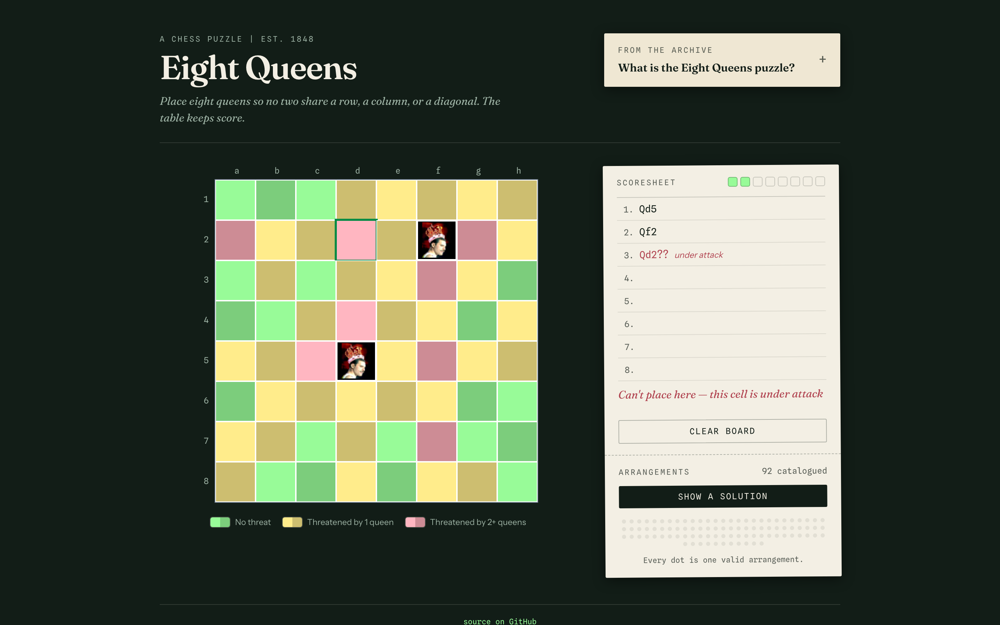
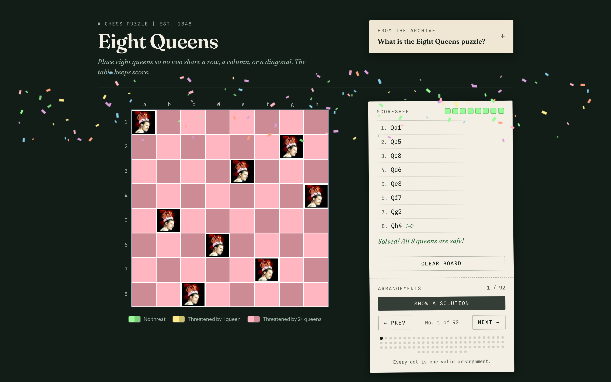
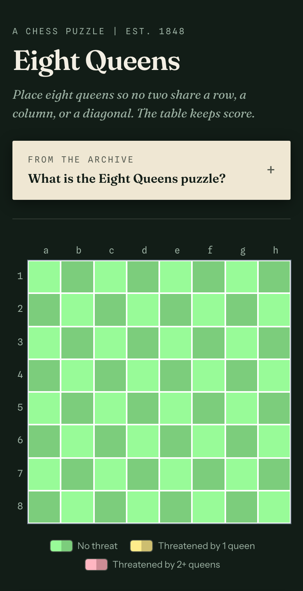

# 8 Queens

An interactive React + TypeScript puzzle: place 8 queens on a chessboard so none can attack each other.

**Live app:** [_https://galiakr.github.io/8queens/_](https://galiakr.github.io/8queens/)

---

## Screenshots







---

## What it does

- **Manual play** click to place queens, threatened squares highlight in real time
- **Animated solver** watch the backtracking algorithm work step by step
- **All 92 solutions** navigate through every valid arrangement
- **Confetti** because solving it deserves a celebration
- **Learn** collapsible panel explains the puzzle, backtracking, and why there are exactly 92 solutions

## Stack

React 18 · TypeScript · Tailwind CSS · Vite · Vitest

## Running locally

```bash
git clone https://github.com/galiakr/8queens.git
cd 8queens
npm install
npm run dev
```

Open [http://localhost:5173](http://localhost:5173).

## Running tests

```bash
npm test              # run once
npm run test:coverage # with coverage report
```

## Original version

This is a rewrite of an [_older vanilla JS version_](https://github.com/galiakr/8queens/tree/vanillajs). The backtracking algorithm is preserved from the original.

## What changed in the rewrite

- Vanilla JS → React 18 + TypeScript
- Single solution → all 92 solutions with navigation
- Static solver → animated step-by-step
- No tests → Vitest unit tests (WIP)
- Accessibility: keyboard navigation, aria-labels, semantic HTML
